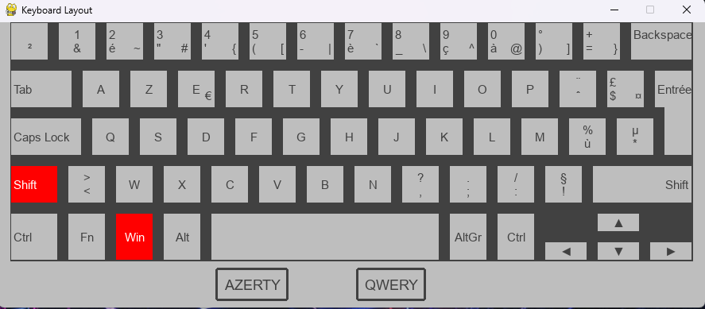

<h1 align='center'>Pygame Tools</a></h1>
<b>

It's some tools i wrotted to make easier code sessions with pygame.

# Debug Tool.
- Use to debug var instead use print.

# Colors.
- Open a window and display all pygame colors.
- When a color is hovered the the windows title will show the color name.
- Mouse click left on a color copy the color name into the clipboard.

# Key board layout.
- Show key pressed in two layouts: QWERTY / AZERTY LAPTOP

    
    

